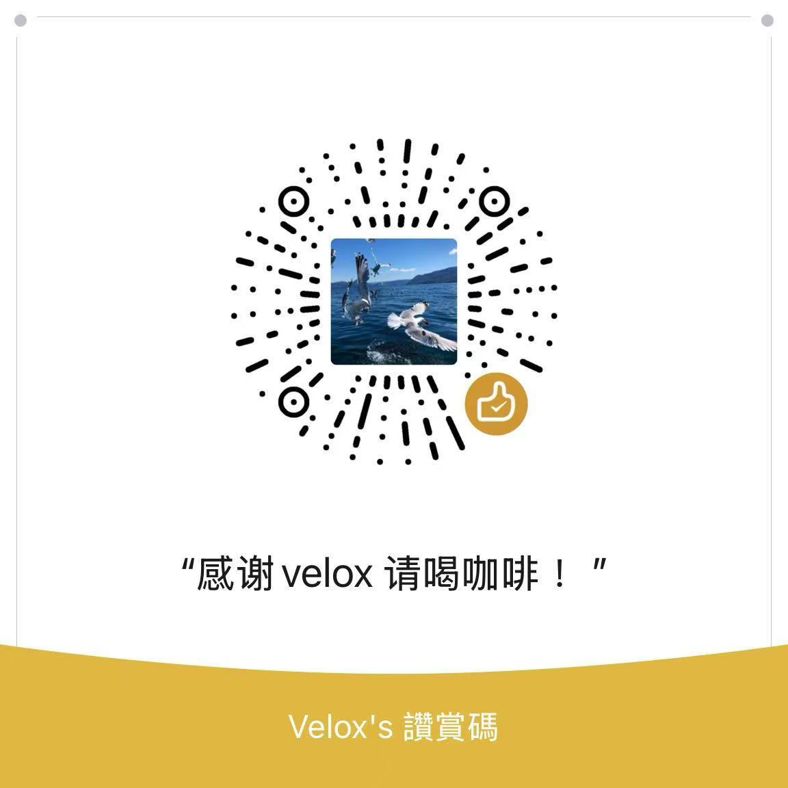

# 🚀 Velox VPS Panel - 极客专属全能运维终端 (V4.1)

  

> **“不只是一个面板，它是拥有智能感知能力的 VPS 私人管家。”**
> 
> 作者 GitHub: [@pwenxiang51-wq](https://github.com/pwenxiang51-wq) | 官方博客: [222382.xyz](https://222382.xyz) | 报告 Bug: [Issues](https://github.com/pwenxiang51-wq/Velox-VPS-Panel/issues)

Velox Panel 是一款专为极客与重度折腾玩家打造的 Linux 终端运维面板。V4.1 版本引入了史诗级的**“智能状态感知引擎”**与**“双核主动防御系统”**，将复杂的代理维护、网络调优、安全防爆破与跨机容灾，全部浓缩进了 27 项极致丝滑的交互菜单中。

---

## ✨ 核心黑科技 (Core Features)

### 🧠 1. 史诗级智能环境感知
告别传统的“死板执行”。Velox 会在每次启动时，动态探测系统底层的运行状态：
- 自动识别并兼容 `apt` / `yum` / `dnf` 等全系包管理器。
- 动态嗅探代理核心 (Sing-box / Xray) 及 Argo 隧道、WARP 的真实接管状态。
- **防断网机制**：执行底层调优与卸载时，智能避让并保护存活的代理容器。

### 🚨 2. SSH 隐身防盗门与双核防御中心
- **一键飞升纯密钥模式**：全平台通用公钥注入，瞬间物理切断密码验证通道。
- **动态状态读取**：直观显示当前防线处于“纯密钥(极安全)”、“混合模式(警告)”还是“纯密码(裸奔)”。
- **双核装甲任选**：支持部署重型装甲 `Fail2Ban`，或极简零消耗的 `纯 Bash 底层机枪塔`。

### 📡 3. 舰队级 TG 智能监控闭环
- **神盾局防爆破预警**：一旦发生未知 SSH 登录，秒级向你的手机推送来源 IP 与时间。
- **开机复苏多核体检**：每次重启后，精准汇报 Sing-box、Argo 隧道、WARP 的存活状态 (智能绕过 WARP 虚拟网卡，强制物理主网卡发信，永不失联)。

### 🧳 4. 全域资产一键克隆与星际舰队
- **无痕跨机搬家**：一键打包 `/root` 与 `/etc` 下的所有面板数据、代理配置及 Acme 证书，新鸡秒变老鸡。
- **星际舰队群控**：生成 Velox 专属独立兵符，一键向所有僚机群发 Linux 运维指令。

### ⚡ 5. 极限网络底层压榨
- **BBR + fq 黄金组合**：智能识别内核版本，暴力注入拥塞控制算法。
- **TCP/UDP 双管扩容**：针对 Hysteria2 / TUIC 等高阶协议大幅调优内核读写窗口，让网速肉眼可见地起飞。

---

## 🚀 极速部署 (Installation)

无需任何前置环境，直接在您的 VPS 终端 (推荐使用 `root` 用户) 执行以下命令，一键安装并呼出面板：

<pre><code class="language-bash">bash &lt;(curl -sL https://sink.222382.xyz/kggwmy)</code></pre>

*(注：后续直接在终端输入 `velox` 即可随时唤醒面板)*

---

## 🗂️ 全景功能矩阵 (The 27-in-1 Matrix)

### 🛡️ 板块一：系统核心运维
- **1.** 📊 查看系统基础信息
- **2.** 💾 查看磁盘空间占用
- **3.** ⏱️ 查看运行时间与负载
- **4.** 📊 快速查看内存报告 (静态快照)
- **5.** 📈 实时监控 CPU 与内存 (按 q 退出)
- **6.** 🔌 查看系统监听端口

### 🚀 板块二：网络高阶调优
- **7.** 📦 查看代理服务运行状态 (深度体检与 IP 查询)
- **8.** 🌐 查看 WARP 与 Argo 出站详情 (带 Token 嗅探保护)
- **9.** 🚀 深度验证与管理 BBR 加速
- **10.** 🧹 一键清理系统垃圾与强制释放内存
- **11.** 🔄 重启 VPS 主机

### 🔌 板块三：代理核心管理
- **12.** 🎬 流媒体解锁检测 (Netflix/ChatGPT等)
- **13.** 🛡️ IP 纯净度与欺诈风险体检 (精准排雷)
- **14.** ⚡ TCP/UDP 网络底层高阶调优 (极限压榨带宽)
- **15.** 🛰️ 全球主流节点 Ping 延迟测速
- **16.** 🚨 设置/管理 SSH 异地登录 TG 报警 (含开机体检报表)

### 🛠️ 板块四：自动化与高阶工具
- **17.** 📈 Velox 流量大管家 (内置 vnstat 持久化数据库 / 云大厂防扣费 / 实时网速视窗)
- **18.** 💽 自定义管理虚拟内存 Swap (1G小鸡救星)
- **19.** 📝 修改服务器主机名 (带极客校验)
- **20.** 🔄 一键更新系统软件库 (静默防卡死全兼容版)
- **21.** 🚨 SSH 智能动态防盗门与双核防御中心 (状态感知/免密飞升/机枪塔)
- **22.** 🚀 召唤甬哥全家桶 (Sing-box 终端版 / X-UI 网页版)

### ⚡ 板块五：核心修复与配置提取
- **23.** ⏱️ 设置定时任务 (极客 crontab 运维化)
- **24.** 🔄 一键修复/重启所有代理服务 (解决掉线/假死/断流)
- **25.** 🔗 节点全能雷达扫描与二维码提取 (通杀提取 vless/vmess/hy2)
- **26.** 🔐 Acme 域名证书深度管理 (Nginx 智能避让续签)
- **27.** 🧳 全域资产跨机搬家与星际舰队中心 (多机容灾/指令群发)

---

## 💻 兼容性说明 (Compatibility)

本脚本高度依赖 `systemd` 作为底层守护支持，并已针对多种环境进行代码级容错与防抖处理：

- 🟢 **完美兼容**: Debian 11/12, Ubuntu 20.04/22.04/24.04
- 🟡 **高度兼容**: CentOS 7/8/9, AlmaLinux, Rocky Linux
- 🔴 **不建议/不支持**: Alpine Linux (无 Systemd 环境), OpenVZ 架构 (受限的内核网络调优)

---

## 🛡️ 卸载说明 (Uninstall)

如果你想让系统恢复极其纯净的出厂状态，可在面板主菜单输入 `U` 进行卸载。
系统将启动**焦土化物理粉碎程序**，抹除所有面板、防御机枪塔、监控探针及网络调优参数，**但会自动智能保留你的代理节点容器与 Acme 证书**，保证业务不断网！

---

## ☕ 赞赏与支持

开源不易，如果 Velox 面板让你的折腾之旅变得更加优雅，为你节省了宝贵的时间，请务必在右上角给我点一个 **Star ⭐️**！你的点赞是我持续维护的唯一动力。

如果大佬觉得项目超赞，欢迎通过微信扫码请我喝杯冰美式，感激不尽！🚀

    
     
     
    <b>“ 感谢 velox 请喝咖啡！ ”</b>

 

Made with ❤️ by [pwenxiang51-wq](https://github.com/pwenxiang51-wq)
